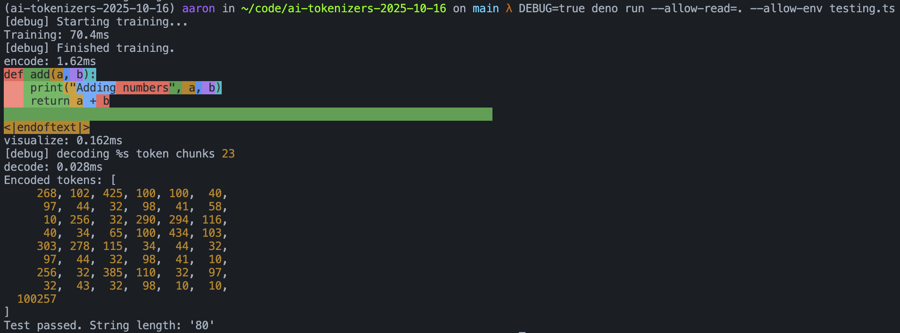

Ignore this. It's a scratch pad while walking through https://www.fast.ai/posts/2025-10-16-karpathy-tokenizers.html

---

To run the tokenizer test:

```
DEBUG=true deno run --allow-read=. --allow-env testing.ts
```


